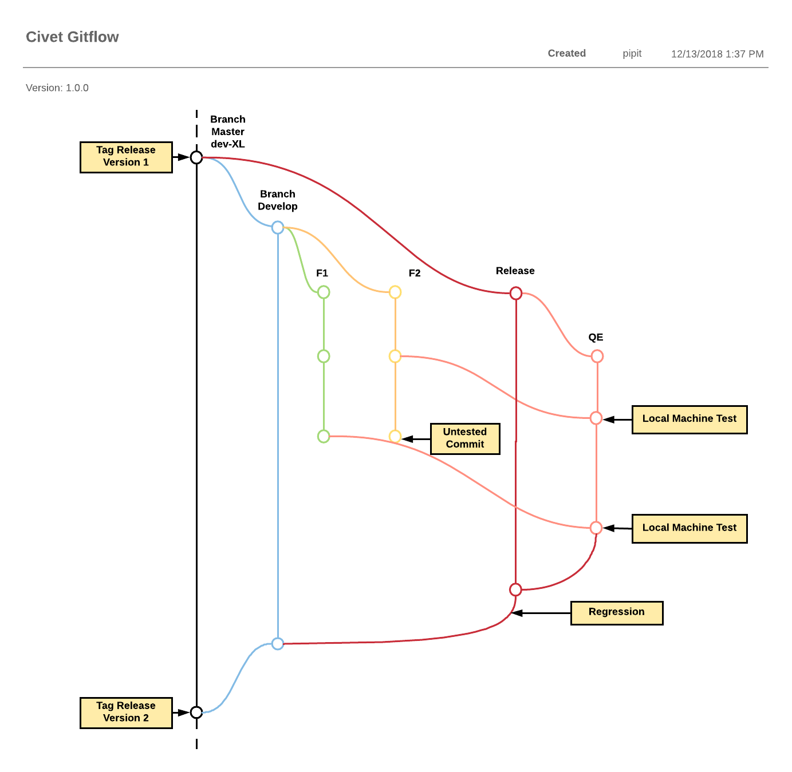

# Development

## Gitflow

## Workflow

Berikut merupakan flow dan wireframe sistem Civet:

https://docs.google.com/spreadsheets/u/1/d/1OyQBW-EYNmhvvK-oWx72Ifx_2ldchPUZdvBpjcgWvWk/edit#gid=0

## Development

Hal-hal yang harus diperhatikan Developer ketika mereka *clone* Civet:

1. Atur Kraken API (*after create partner* di Kraken). Di menu Configuration -> Web Services -> Kraken API Settings dan di **menu/admin/commerce/config/topup/provider/kraken.**
2. Atur Veritrans Callback. Tetapkan *client key* di setiap aturan metode pembayaran dan *set* Civet *url callback* di menu Admin Sepulsa Veritrans.
3. *Set* *email header* di *mimemail file*(*code*).
4. *Set* *product package code* di **/admin/commerce/config/product-variation-types/pulsa/fields/field_package_code**.
5. *Set completion message* untuk *Thank You page* Frigate di **/admin/commerce/config/checkout/form/pane/checkout_completion_message**.
6. *Set tools* untuk CS and Ops (misalnya, *reprocess transaction* atau laporan yang diperlukan dari Ops)
7. *Set MDR module* (opsional jika *partner* menginginkan *MDR fee* yang dibayar pelanggan).
